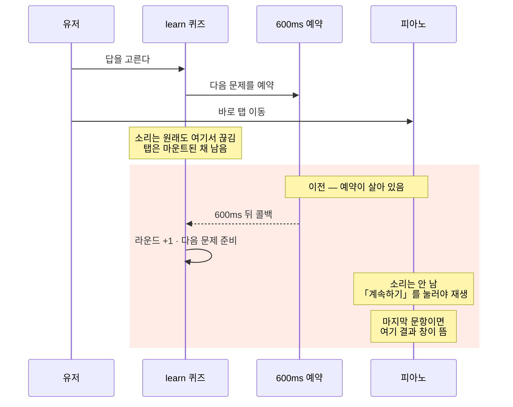
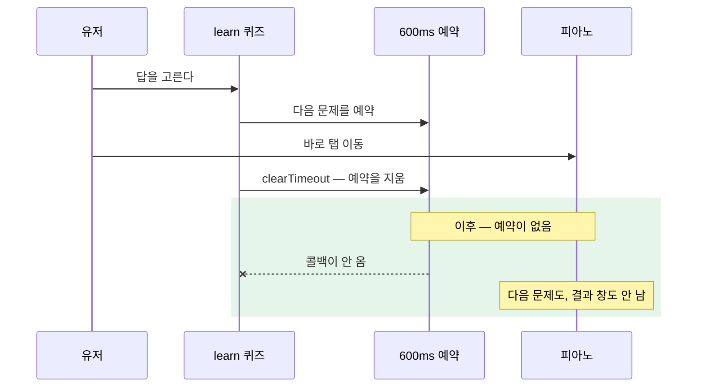

# learn — 탭 이탈에서 다음 문제 타이머를 끊는다

**구현됨 (세션 69 · `b4f7f1c`).** 이 파일은 그때 고친 자리의 **이전/이후 비교**다.
지금 코드가 무엇인지는 다음을 본다 —

| 무엇 | 어디 |
|---|---|
| 답을 고른 뒤 600ms 타이머를 거는 곳 | `hooks/useWordGameLogic.ts`의 `handleAnswer` |
| 그 타이머를 **끊는 함수** | 같은 파일 `clearNextRoundTimer` |
| 탭을 나갈 때 그 함수를 **부르는 곳** | `components/game/WordGame.tsx`의 `useStopAudioOnBlur` |

경위는 인계문 [`doc/handoff13.md`](./handoff13.md) 「세션 69」에 있다.
소리만 끊는 훅의 뜻은 [`hooks/useStopAudioOnBlur.ts`](../hooks/useStopAudioOnBlur.ts) 주석이 갖는다.

> 화면에 그대로 있으면 **전과 같다.** 답을 고르고 바로 다른 탭으로 나갈 때만 갈린다.

---

## 한 줄

탭은 바꿔도 **언마운트되지 않는다.** 그래서 「화면이 닫힐 때 정리」만으로는
600ms 뒤에 예약된 다음 문제가 **다른 탭에서 혼자 준비**됐다.
끊는 스킬은 `setTimeout` id를 ref에 담고, **떠나는 순간 `clearTimeout`** 하는 것이다.

---

## 시각 — 답을 고르고 바로 피아노 탭으로 나갈 때

같은 조작이다. 갈리는 것은 **600ms가 끝난 뒤**다.





| | 이전 | 이후 |
|---|---|---|
| 지금 나던 소리 | 나갈 때 끊김 | 같다 |
| 600ms 뒤 다음 문제 | **혼자 준비됨** (소리는 안 남) | **준비 안 됨** |
| 마지막 문항에서 나감 | 다른 탭에 **결과 창** | 결과 창 안 뜸 |
| 그 화면에 그대로 있음 | 600ms 뒤 다음 문제 | 같다 |

다음 문제는 `startNewRound`가 `ready`만 만든다. 소리는 「계속하기」를 눌러야 난다.
그래서 이전에도 **다른 탭에서 다음 문제 소리는 안 들렸다.**
티가 난 것은 「돌아왔더니 문제가 바뀌어 있다」와 「다른 탭에 결과 창」이다.

---

## 끊는 스킬 — 왜 소리만 끊어서는 안 되나

`setTimeout`은 화면과 무관하다. 탭을 나가도, 컴포넌트가 살아 있으면 **시간이 되면 실행**된다.

이 앱의 탭은 `unmountOnBlur`를 쓰지 않는다. 한 번 연 탭은 **마운트된 채** 남는다.
그래서 언마운트 `useEffect` 클린업은 탭 전환에서 **한 번도 안 돈다.**

| 떠나는 일 | 언마운트 클린업 | `useStopAudioOnBlur` |
|---|---|---|
| 앱을 완전히 닫음 | 돈다 | — |
| 다른 탭으로 이동 | **안 돈다** | 돈다 |

세션 69 전에는 블러에서 **소리만** 끊었다.
타이머를 끊는 함수(`clearNextRoundTimer`)는 훅 안에 **이미 있었다** —
그만하기 · 난이도 변경 · 언마운트에서만 썼고, **탭 이탈에서는 안 불렀다.**

스킬은 새 장치가 아니다. **이미 있는 끊기를, 떠나는 길에도 연결한 것**이다.

```
1. 예약할 때    id를 ref에 담는다          nextRoundTimerRef.current = setTimeout(...)
2. 끊을 때      그 id로 clearTimeout        clearNextRoundTimer()
3. 떠날 때      2를 반드시 부른다           useStopAudioOnBlur 안에서
```

3을 빼먹으면 1은 다른 화면에서 늦게 터진다.

---

## 코드 비교 — 블러에서 무엇을 부르나

자리: `components/game/WordGame.tsx` · `useStopAudioOnBlur`

### 이전

```ts
useStopAudioOnBlur(() => {
  audioPlayer.stopSound();

  if (gameState === 'playing') {
    setAnswered();
  }
});
```

### 이후

```ts
useStopAudioOnBlur(() => {
  audioPlayer.stopSound();
  clearNextRoundTimer();

  if (gameState === 'playing') {
    setAnswered();
  } else if (gameState === 'waitingForNextRound') {
    resetGame();
  }
});
```

### 기술

- **이전:** 재생 중인 플레이어만 멈춘다. `handleAnswer`가 걸어 둔 600ms는
  `nextRoundTimerRef`에 그대로 남아, 시간이 되면 `startNewRound` 또는 `onGameComplete`가 돈다.
- **이후:** 같은 콜백에서 `clearNextRoundTimer()`를 먼저 부른다.
  `clearTimeout`으로 예약을 지운다. 콜백은 도착하지 않는다.
- `waitingForNextRound`에서 `resetGame()`을 더한 이유:
  타이머만 끊으면 채점 빗장이 잠긴 채 피드백 화면에 굳는다.
  연습은 부모(`learn/index.tsx`)가 블러에서 게이지·라운드를 0/1로 되돌리므로
  자식도 리셋하는 쪽이 맞다.

### UX

- **이전:** 나갔다가 돌아오면 이미 다음 문제(「계속하기」)이거나, 마지막이면 결과 창이 다른 탭에 뜬다.
- **이후:** 다음 문제도 결과 창도 안 남는다. 연습 피드백 중에 나가면 1라운드부터다.
- 「듣는 중」에 나가는 길은 그대로다 — `setAnswered`로 선택지만 열어 두고 문제·점수는 남긴다.

### 왜

막는 것은 탭 이동이 아니다. **떠나 있는 동안 퀴즈가 혼자 진행되는 것**이다.

---

## 코드 비교 — 끊는 함수 자체

자리: `hooks/useWordGameLogic.ts`

이 블록은 **세션 69 전에도 있었다.** 바뀐 것은 화면이 이걸 **블러에서 부르게** 된 것이다.
훅은 `clearNextRoundTimer`를 return에 내보내, `WordGame`이 받게 했다.

```ts
const nextRoundTimerRef = useRef<ReturnType<typeof setTimeout> | null>(null);

const clearNextRoundTimer = useCallback(() => {
  if (nextRoundTimerRef.current) {
    clearTimeout(nextRoundTimerRef.current);
    nextRoundTimerRef.current = null;
  }
}, []);
```

답을 고르면 이렇게 건다. 이것도 이전과 같다.

```ts
setGameState('waitingForNextRound');

clearNextRoundTimer();
nextRoundTimerRef.current = setTimeout(() => {
  nextRoundTimerRef.current = null;
  setShowFeedback(false);
  if (round >= maxRounds) {
    onGameComplete?.(...);   // 마지막이면 결과
  } else {
    setRound((prev) => prev + 1);
    startNewRound();         // 다음 문제 준비. 소리는 안 냄
  }
}, 600);
```

| | 기술 | UX |
|---|---|---|
| `ref`에 id를 담는 이유 | 렌더가 바뀌어도 같은 예약을 가리킨다. state면 끊을 때 옛 id를 잃는다 | 사용자는 타이머를 못 본다 |
| 걸기 전에 한 번 비우는 이유 | 연타하면 예약이 두 개다. 뒤늦은 콜백이 한 번 더 넘어간다 | 한 번에 한 문제만 |
| `current = null`을 콜백 안에서 하는 이유 | 이미 끝난 id를 다시 `clearTimeout`하지 않게 | — |

---

## 같은 화면에 그대로 있을 때

이 길은 **손대지 않았다.**

```
답 고름 → ⭕/❌ 600ms → 다음 문제 준비 → 「계속하기」 → 소리
```

확인은 답을 고르고 **그 600ms 안에** 다른 탭으로 가는 경우만 보면 된다.
마지막 문항이면 다른 탭에 결과 창이 안 뜨는지가 본래 목적이다.
